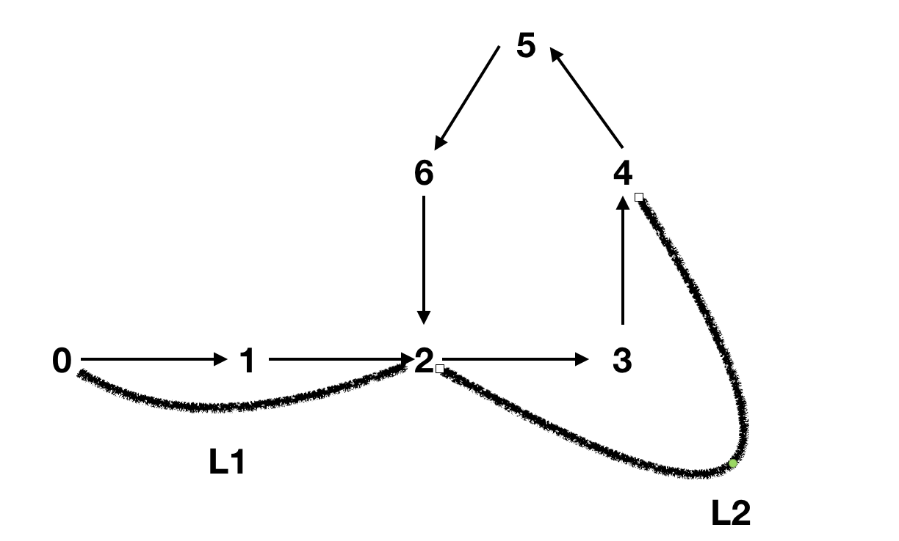
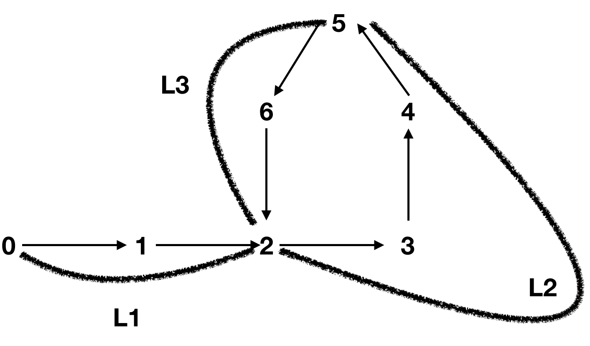

定义:

* 链表头指针head到链表环的入口处的距离为$L_1$
* fast指针距离环的入口的距离为$L_2$
* fast已经在环内走了$N_1$圈
* 假设slow在经过i步与fast相遇
* 环的周长为C
* fast和slow走过的总路程分别为$disFast$和$disSlow$

当slow走到环入口时,可得知:
$$
\begin{split}
disFast&=L_1 + L_2  + N_1C  \\
disSlow&=L_1
\end{split}
$$
又因为fast每次走两步,即比slow快一倍,所以若两个指针相遇,则有:
$$
(disSlow+ i - L_1)  \mod  C = (disFast + 2i -L_1) \mod C 
$$
减去$L_1$是为了减掉不在环内的长度从而求得相遇点相对于环入口的距离,由于等式的值实际上是相对于环入口的距离,所以有:
$$
i \mod C =(L_2 + N_1C +2i) \mod C \\
\Rightarrow (L_2 + N_1C + i) \mod C =0 \\
\Rightarrow (L_2 + i)  \mod C =0 (加减C的整数倍对于取模没有影响)
$$
所以,$L_2+ i$总和等于环的周长整数倍时,等式成立,实际上也求出了i的值。

对于任意$L_2$,都可以求出无数个i值,每个值都对应一个周长的整数倍,而对于每一个i值,最终相遇的位置都一样,当$slow$和$fast$相遇后,由于2倍速度的关系,当$slow$继续走半圈的时候,$fast$走一一圈回到了之前的相遇点,当$slow$再走半圈回到了之前的相遇点，$fast$又走了一圈回到了之前的相遇点。

####求环的入口

定义：

* $L_1$为链表头head到环入口的距离
* $L_2$为环入口向前到相遇点的距离
* $L_3$为相遇点向前到环入口的距离
* C为环的周长
* $N_1$和$N_2$分别为slow和fast在相遇时走过的圈数
* disSlow和disFast分别为slow和fast在相遇时走过的距离

$$
disSlow= L_1 + L_2 + N_1C \\
disFast=L_1 + L_2 + N_2C
$$

又因为fast速度是slow的2倍,所以:
$$
\begin{split}
disSlow * 2  & = disFast \\
 \Rightarrow 2(L_1 + L_2 + N_1C) &= L_1 +L_2 +N_2C \\
 \Rightarrow L_1 +L_2 +2N_1C &N_2C \\
 \Rightarrow L_1 &= (N_2 -2N_1)C -L_2
\end{split}
$$
因为fast的速度是slow的两倍,所以$N_2$至少是$N_1$的两倍(至少而不是恰好是因为fast进入环时slow可能没进入环)，所以fast可能先在环内走几圈。

即
$$
N_2 \ge 2N_1
$$
当$N_2$等于2倍的$N_1$时,$L_1$和$L_2$都为0,也就是整个链表就是一个环。

由此可以看出,$L_1$即链表头head到环入口的距离等于$(N_2-2N_1)C-L_2$,其实就等于$L_3 +(N_2-2N_1 -1)C$ 

而从相遇点向前走$L_3 +(N_2 -2N_1-1)C$的距离(即走$L_3$的距离,加$N_2-2N_1-1$个圈),正好走到了环的入口。

所以推导出算法：

**让两个指针其中一个从链表头head出发,一次走一步,让另一个指针从相遇点出发,也一次走一步,相遇点就是环的入口**

