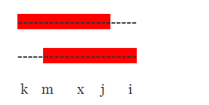
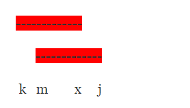

**一个字符串的最小循环节为: len-next[len]** 

**循环次数为: $len/ (len-next[len])$**

证明：

abcabc的最小循环节是: abc

abcda的最小循环节是 : abcd

abbab的最小循环节是: abb

证明开始:

由上,next[i]=j,两段红色的字符串相等， s[k...j]==s[m...i]

设s[x...j] =s[j...i] (记为: xj==ji)

则可得:
$$
\begin{split}
kj&= kx+xj  \\
mi&=mj+ji
\end{split}
$$
因为
$$
xj=ji
$$
所以:
$$
kx=mj
$$
如下图所示:

此时,又重复上面的模型, kx=mj,此时可以一直这样地推下去

所以可以推出一个重要的性质 len-next[len] 为此字符串的最小循环节。

另外:如果
$$
len \% (len -next[len]) ==0
$$
此字符串的最小周期就为:
$$
len/(len-next[i])
$$
