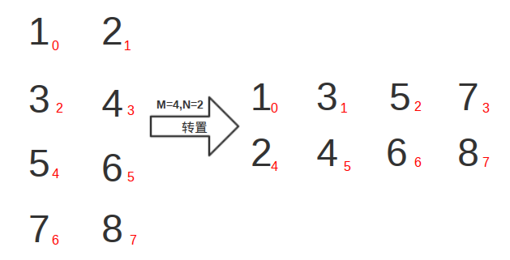
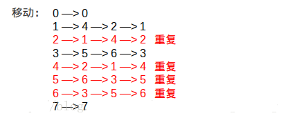

### 问题:

将一个M * N 的矩阵存储在一个一维数组中,编程实现矩阵转置

要求:空间复杂度为O(1)

### 分析

以4*2的矩阵A={1,2,3,4,5,6,7,8}进行分析,转置过程如图:

图中右下角的红色数字表示在一维数组中的下标，矩阵的转置其实就是数组中元素的移动,具体的移动过程如下图:

这些移动的元素的下标是一个个环,下标1的元素移动到4,下标4的元素移动到2,下标2的元素移动到1,

在编写程序的时候,需要解决两个问题：第一个是如何判定环是否重复(已处理过),第二个是如何计算当前元素下标的前驱和后继。

* 如何判断环是重复处理过的？因为遍历数组的时候下标是从小到大的,所以如果是第一次遍历该环,则第一个下标肯定是这个环中最小的。如果一个环被处理过,那么总能找到一个它的后继是小于它的。从上图明显可以看出来。
* 第二个问题:如何计算当前元素下标的前驱和后继?假设转置前某个元素的数组下标为i,则它所在行列为(i/N,i%N),转置后所在行列则为(i%N,i/N),可计算转置后数组下标为 (i%N)&times;M + i/N,此为i的后继。假设转置后某个元素的数组下标为i,则它所在行列为(i/M,i%M),则转置前所在行列为(i%M,i/M),可计算此时下标为(i%M)&times;N+i/M,此为i的前驱。